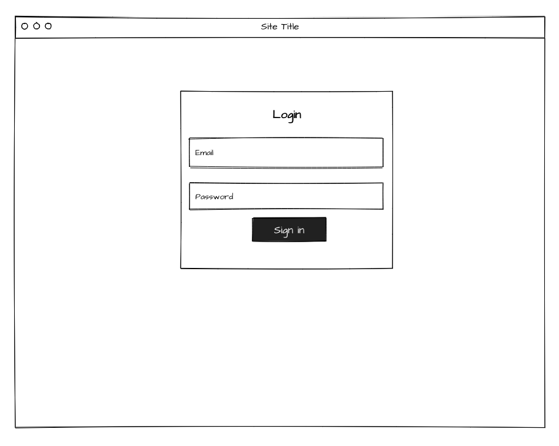

# Welab Software Engineer Challenge - Frontend

- [Functional Requirements](#functional-requirements)
- [Other Requirements](#other-requirements)
- [Nice-to-Haves (Optional)](#nice-to-haves-optional)
- [Wireframes](#wireframes)
- [Frameworks and Libraries](#frameworks-and-libraries)

## Functional Requirements

1. Create a one page application which has a log in form to accept email and password inputs
2. Submit them to the [Mock API](https://demo6650602.mockable.io/auth/login) using POST method
3. Display an message to notify a successful login

## Other Requirements

1. Support modern browsers

## Nice-to-Haves (Optional)

1. Mobile friendly
2. Additonal UI features to enhance user experience

## Wireframes

## Frameworks and Libraries

We use React at Welab. However you are free to use any framework or library for this challenge.
